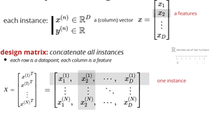

# Decision Tree

## What is it 

Decision tree is machine learning model that use tree-based architecture to do the regression and classification. Because of its nature of model structure, it is interpretable, which means the features importances can be explained intuitively. 

## DT idea

## Prediction per region

### For regression:

### For classification:

## Feature types

### Continuous:

**In order to come up with a split point, the values are sorted, and the mid-points between adjacent values are evaluated in terms of some metric, usually information gain or gini impurity.** For your example, lets say we have four examples and the values of the age variable are \(20,29,40,50\) \(20,29,40,50\). The midpoints between the values \(24.5,34.5,45\)\(24.5,34.5,45\) are evaluated, and whichever split gives the best information gain \(or whatever metric you're using\) on the training data is used.

You can save some computation time by only checking split points that lie between examples of different classes, because only these splits can be optimal for information gain.

### Ordinal:

### Categorical:

## Cost Function

### Regression cost

### Classification cost

## Search space

**Objective**:

find a decision tree with K tests minimizing the cost function; alternatively, find the **smallest tree \(K\)** that classifies all examples correctly

Assuming D features, how many different partitions of size K+1? the number of full binary trees with K+1 leaves \(regions R\_k \) is the Catalan number  

 

## Greedy heuristic

* recursively split the regions based on a greedy choice of the next test
* end the recursion if not worth-splitting

## Stopping the recursion

if we stop when  has zero cost, we may overfit heuristics for stopping the splitting:

## Entropy loss

### Why?

entropy is the expected amount of information in observing a random variable **y**

## Mutual information

 

## Entropy for classification cost

## Gini index – the way to split the tree

Gini:  the goal is to _“measure how often a randomly chosen element from the set would be **incorrectly** labeled_

While building the decision tree, we would prefer choosing the attribute/feature with the **least** Gini index as the root node.

### Calculation

\*\*\*\*

**EX.** 

**4 red and 0 blue:**

The impurity measurement is 0 because we would never incorrectly label any of the 4 red gumballs here. If we arbitrarily chose to label all the balls ‘blue’, then our index would still be 0, because we would always incorrectly label the gumballs.

> The gini score is always the same no matter what arbitrary class you take the probabilities of because they always add to 0 in the formula above.

A gini score of 0 is the most pure score possible.

**2 red and 2 blue:**

The impurity measurement is 0.5 because we would incorrectly label gumballs wrong about half the time. Because this index is used in binary target variables \(0,1\), a gini index of 0.5 is the least pure score possible. Half is one type and half is the other. **Dividing gini scores by 0.5 can help intuitively understand what the score represents. 0.5/0.5 = 1, meaning the grouping is as impure as possible \(in a group with just 2 outcomes\).**

3 red and 1 blue:

The impurity measurement here is 0.375. If we divide this by 0.5 for more intuitive understanding we will get 0.75, which is the probability of incorrectly/correctly labeling.

### How to split

Then choose the least Gini impurity - **Good Blood Circulation as the leaf node**

### Information gain

#### How to split: Similar with Gini index split





### Gini vs Information Gain

| **Algo / Split Criterion** | **Description** | **Tree Type** |
| :--- | :--- | :--- |

| Gini Split / Gini Index | Favors _**larger**_ partitions. Very simple to implement. | CART |
| :--- | :--- | :--- |

| Information Gain / Entropy | Favors partitions that have _**small**_ counts but many _**distinct**_ values. |  ID3 / C4.5 |
| :--- | :--- | :--- |

## Overfitting

**large decision trees have a high variance – low bias \(low training error, high test error\)**

1. grow **a small tree**

substantial reduction in cost may happen after a few steps by stopping early we cannot know this

## Pruning

2. grow a large tree and then prune it greedily turn an internal node into a leaf node choice is based on the **lowest increase in the cost** repeat this until left with the root node pick the best among the above models using using a validation set

3. random forests \(later!\)

## When/where to use it 

1. classification
2. explain non-linear relationship

## What it can do and what it can't do

### Pros:

decision trees are interpretable!

they are not very sensitive to outliers

do not need data normalization

### Cons:

they could easily overfit and they are unstable:

avoid by:

* pruning
* random forest

