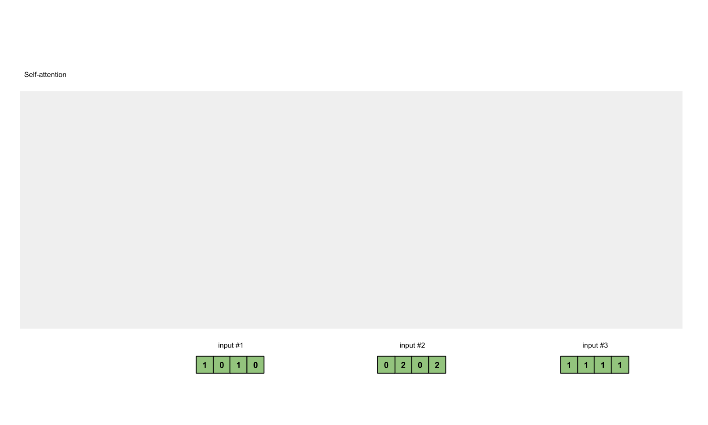

# Transformer

Transformer is an algorithm that uses attention mechanism to boost the training speed by parallelization. It is widely used in Natual Language Processing, Time-series data analysis. It has the architecture of encoder and decoder.

**Encoder Illustrative Explain:** Use others to represent who I (one input embedding) am by getting the similarity with others (input embeddings) (who I am most closed by), generate a representation of myself.

**Decoder Illustrative Explain:** Use others to represent who I (one output embedding) am by getting the similarity with others (output embeddings), try to find the most similar one from input representations from Encoder with me, if there is a match (close enough, highest attention score in decoder), this is my soul mate (output is the translation of input).



Paper: Attention is all you need

## Architecture:

.png>)

Multi-headed attention is a module in the transformer network that computes the attention weights for the input, and produces an output vector with encoded information on how each word should attend to all other words in the sequence.

## Multi-Headed Attention

### \*\*Self-attention: \*\*Query, key and value

“The query key and value concept come from retrieval systems. For example, when you type a query to search for some video on Youtube, the search engine will map your **query** against a set of **keys** (video title, description etc.) associated with candidate videos in the database, then present you the best matched videos (**values**).

**Purpose** of SELF-attention, Use others to represent who you are. Imagine that we have a group of people (sentence/words), and we need to translate to another group of people. we need to find out who is the person that is closest to me (one word) so that he can help me to represent myself so that during the translation, we will use this person to remind/identify myself (the word) to be able to translate.

.png>)

So \*\*basically, the dot product of Query and Key is computing their cosine similarity to see how these two related to each other, also, because we always want to find the best match item, the cosine similiary is supposed to be higher is better, so it is also the indicator of higher score get more focus. \*\*Then scale the product by square root of dimension and get their softmax value to enhance the larger value so that we will get clue on where to get more attention (By doing a softmax the higher scores get heighten, and lower scores are depressed. This allows the model to be more confident about which words to attend too.). **Then the calculated attention matrix will have a dot product with the Value, which the higher softmax scores will keep the value of words/embedding the model learns is more important.**

### Self-attention Procedure

1. Randomly initialize weight matrix for query, key and value
2. Calculate query, key and value by dot product of the input X and their corresponding weight matrix
3. Dot product of Key and Query to get the attention score
4. Softmax the attention score across all the input
5. Multiply the attention score by the Value to get the weighted vector
6. Add all weighted vector to get output for its corresponding input
7. Repeat 2 - 6 until end of the sentence

Note: the magnitude of output vectors is the attention that they paid to other input vector

Note: why it works: the Query of each input vector multiply the Key of all other input vectors (including itself) to get similarity, once get higher similarity/attention score, this current specific output should pay more attention on it



.png>)

### Where Query, Key and Value come from?

Query, Key and Value are **all the linear transformation of the input X**, by dot product of different **trainable randomly initialized weight matrix**

.png>)



.png>)

_**For example: unsupervised language model (dot product of Q and K):**_

.png>)

**Why we need Vector:** after getting the softmax result from Q and K, which is essentially a weight or attention that the embedding matrix need to focus, we need calculate the weighted vector so that we can understand which part should pay more attention

### Multi-attention head

Set number of multi-attention head N, then split Query, Key and Value to N times of splitting.

**To make this a multi-headed attention computation, you need to split the query, key, and value into N vectors before applying self-attention. The split vectors then go through the self-attention process individually. Each self-attention process is called a head. Each head produces an output vector that gets concatenated into a single vector before going through the final linear layer. In theory, each head would learn something different therefore giving the encoder model more representation power.**

.png>)

### Why Multi-head?

Just like the various convolutional filters in CNN, multi-head aims to capture the various information by different randomly initialized weight matrixes in query, key and value

### The Residual Connections, Layer Normalization, and Feed Forward Network

.png>)

#### Understanding

.png>)

Orignial positional embedding was added to multi-headed attention output vector, which retaining the position related information which we are adding to the input representation/embedding across the network. This part uses the idea of Resnet, which is able to train a very deep neuron network without gradient vanishing by skipping some layers

.png>)

***

***

***
